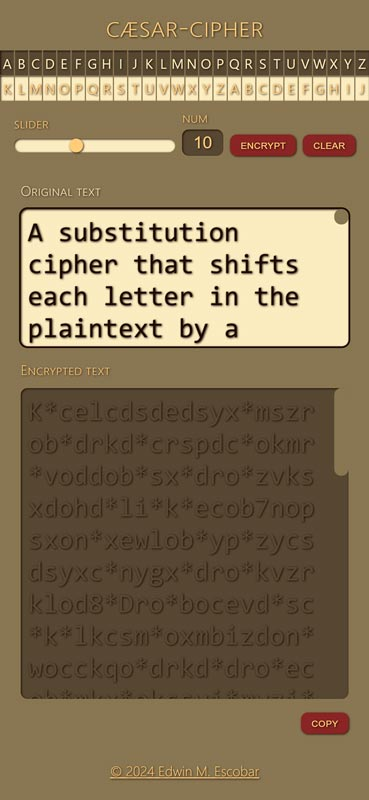

# caesar-cipher

## Description
[Repo](https://github.com/escowin/caesar-cipher) | [Live URL](https://escowin.github.io/caesar-cipher/)

A substitution cipher that shifts each letter in the plaintext by a user-defined number of positions down the alphabet. The result is a basic encrypted message that the user can easily copy with a click of a button.

I wrote this because I wanted to combine my interests in history, encryption, and computer science. Knowing that character strings can be represented by ASCII values, I applied basic programming principles to generate an encrypted string by capturing user input.

Plans include expanding character sets to encompass numbers, symbols, accented letters, and non-Latin scripts for encryption while utilizing Progressive Web App features & IndexedDB for offline functionality & persistent memory storage.

## Table of Contents
- [Usage](#usage)
- [Features](#features)
- [Credits](#credits)
- [Author](#author)

## Usage
To use the **caesar-cipher**, follow these steps:

1. Enter Original Text: In the "Original text" textarea, input the text you want to encrypt.

2. Set Substitution Degree: Use either the slider or the number input field to specify the degree of substitution (shift value). The shift value determines how many positions each letter will be shifted in the encryption process.

3. Encrypt Text: Click the "encrypt" button to generate the encrypted text based on the entered original text and substitution degree.

4. Copy Encrypted Text: Once the encrypted text appears in the "Encrypted text" textarea, click the "copy" button to copy it to your clipboard for easy sharing or storage.

5. Clear Original Text: To clear the original text field for entering new text, click the "clear" button.

By following these steps, you can conveniently generate encrypted messages, copy them for further use, and clear the original text field for new input.

## Features
- **Rule of Least Power Approach**: The application prioritizes HTML over CSS and CSS over JavaScript where applicable, following the principle of least power to keep the codebase simple and maintainable.
- **Accessibility**: Emphasis is placed on accessibility on the HTML side, ensuring proper labeling of form elements and semantic HTML structure for screen reader users.
- **Visual Cues**: CSS pseudocode provides visual cues for interactive elements, enhancing user experience and guiding user interactions.
- **Algorithmic Approach**: The algorithm encrypts text based on its ASCII position, shifting each alphabetic character's ASCII value to the right by the specified "num" value.
- **Clipboard API Integration**: The application utilizes the Clipboard API to allow users an easy way to copy the encrypted text to their clipboard for further use.

## Credits
- Languages: JavaScript, CSS, HTML

## Author
### Edwin Escobar
- [Email](mailto:edwin@escowinart.com)
- [GitHub](https://github.com/escowin)
